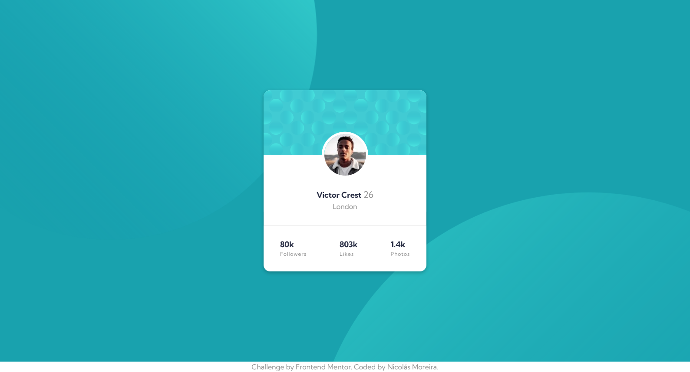

# Frontend Mentor - Profile card component solution

This is a solution to the [Profile card component challenge on Frontend Mentor](https://www.frontendmentor.io/challenges/profile-card-component-cfArpWshJ). Frontend Mentor challenges help you improve your coding skills by building realistic projects. 

## Table of contents

- [Overview](#overview)
  - [The challenge](#the-challenge)
  - [Screenshot](#screenshot)
  - [Links](#links)
- [My process](#my-process)
  - [Built with](#built-with)
  - [What I learned](#what-i-learned)
- [Author](#author)

## Overview

### The challenge

- Profile card component challenge hub. The challenge is to build out this profile card component and get it looking as close to the design as possible.

### Screenshot

### Links

- Solution URL: [Add solution URL here](https://github.com/ichiklaus/profile-card-c)
- Live Site URL: [Add live site URL here](https://ichiklaus.github.io/profile-card-c)

## My process

### Built with

- Semantic HTML5 markup
- CSS custom properties
- Flexbox
- Mobile-first workflow

### What I learned

I learned more about the background properties.

If you want more help with writing markdown, we'd recommend checking out [The Markdown Guide](https://www.markdownguide.org/) to learn more.

## Author

- Website - [Nicolas] [Moreira] (https://ichiklaus.github.io/nicolas-portfolio/)
- Frontend Mentor - [@ichiklaus](https://www.frontendmentor.io/profile/ichiklaus)
- Twitter - [@ichiklaus](https://www.twitter.com/ichiklaus)

